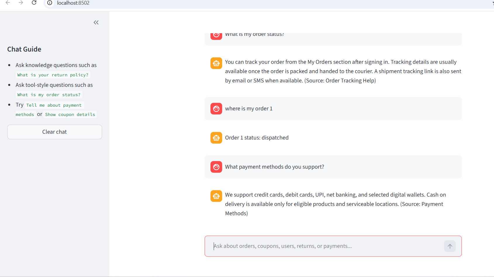
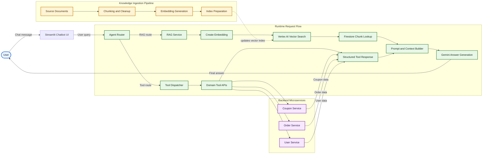

# Agentic Ecommerce Assistant

## Overview

Agentic Ecommerce Assistant is an end-to-end reference implementation for a conversational AI system in an ecommerce setting. It combines retrieval-augmented generation, domain tool routing, and backend microservices to answer user questions with both indexed knowledge and live operational data.

Core capabilities:

- Vector retrieval using Google Vertex AI Matching Engine
- Semantic embeddings via `gemini-embedding-001`
- Generative responses through `gemini-2.5-flash`
- Firestore as both a knowledge store and transactional store
- Spring Boot microservices for coupons, orders, and users

The assistant uses a RAG pipeline to retrieve relevant context from a chunked knowledge base, then combines that context with Gemini-based answer generation. When a query requires live business data, the agent can call backend services instead of relying only on indexed content.



## Architecture At a Glance



### Diagram Notes

- The Streamlit chatbot is the primary user interface for end-to-end testing and demo flows.
- `RAG route` means the query can be answered from indexed knowledge.
- `Tool route` means the assistant needs live operational data from backend services.
- `Structured Tool Response` represents normalized service output before the final answer is composed.
- The dotted arrow from `Index Preparation` to `Vertex AI Vector Search` shows a background update flow, not a per-request runtime call.

### Plain Text Flow

1. A user sends a message through the Streamlit chatbot UI.
2. The router decides whether to use the RAG pipeline or the tool pipeline.
3. The RAG path performs embedding, vector retrieval, Firestore lookup, prompt construction, and Gemini answer generation.
4. The tool path calls local backend services for orders, coupons, or users and feeds those results into answer generation.
5. The ingestion pipeline prepares and refreshes the vector index used during retrieval.

---

## Repository Structure

### `ai-agent/`

Python-based RAG service and ingestion utilities.

- `agent.py` - Routes incoming requests across RAG and tool flows.
- `rag_service.py` - Handles retrieval, embeddings, Firestore lookup, and Gemini prompt assembly.
- `create_vector_index.py` - Creates the Vertex AI Matching Engine index.
- `deploy_vector_index.py` - Deploys the vector index for serving.
- `streamlit_app.py` - Streamlit chatbot UI for browser-based testing.
- `ingestion/` - Chunking and embedding preparation pipeline.
- `tools.py` - Router for FAQ fallback and live local API calls.
- `tools/` - Domain tool wrappers for coupon, order, and user operations.
- `test_*` - Local tests for RAG behavior.

### `backend/`

Spring Boot microservices for operational data access.

- `coupon-service` - Coupon lookup API such as `/coupons/{code}`
- `order-service` - Order APIs such as `/orders/{id}` and `/orders/{id}/status`
- `user-service` - User APIs such as `/users/register` and `/users/{id}`

### Other directories

- `docs/` - Project documentation
- `frontend/` - Frontend assets and UI work
- `knowledge-base/` - Knowledge content used for ingestion

---

## Prerequisites

Before running the project, make sure you have:

- Python 3.10+
- Java 17+
- Maven 3.8+
- Google Cloud SDK (`gcloud`) authenticated to your project
- Vertex AI API enabled
- Firestore in Native mode

Recommended environment variables:

- `GOOGLE_CLOUD_PROJECT` - Your Google Cloud project ID
- `GOOGLE_CLOUD_LOCATION` - Deployment region such as `us-central1`
- `VERTEX_INDEX_RESOURCE_NAME` - Full Vertex AI Matching Engine index resource name
- `VERTEX_INDEX_ENDPOINT_RESOURCE_NAME` - Full Vertex AI Matching Engine endpoint resource name
- `VERTEX_DEPLOYED_INDEX_ID` - Deployed index ID, for example `ecommerce_rag_deployed`
- `VERTEX_INDEX_ENDPOINT_DISPLAY_NAME` - Optional display name used when creating a new endpoint
- `VERTEX_VECTOR_DATA_URI` - GCS path for Vector Search import data, for example `gs://your-bucket/vector_data/`
- `VERTEX_INDEX_DISPLAY_NAME` - Optional display name used when creating a new index
- `VERTEX_INDEX_DESCRIPTION` - Optional description used when creating a new index
- `VERTEX_EMBEDDING_DIMENSIONS` - Embedding vector size, default `3072`
- `VERTEX_APPROXIMATE_NEIGHBORS_COUNT` - Optional Vector Search tuning value, default `10`
- `VERTEX_LEAF_NODE_EMBEDDING_COUNT` - Optional Vector Search tuning value, default `500`
- `VERTEX_LEAF_NODES_TO_SEARCH_PERCENT` - Optional Vector Search tuning value, default `7`

Optional for local testing:

- `GCLOUD_AUTH`

---

## Setup and Run

### AI agent

1. Install Python dependencies:

```bash
cd ai-agent
python -m pip install -r requirements.txt
```

2. Build embeddings from the knowledge base:

```bash
cd ai-agent/ingestion
python build_embeddings.py
```

This generates the Vector Search import file as `ai-agent/data/rag_chunks.json` in newline-delimited JSON format. Each line is a single record with `id`, `embedding`, and `embedding_metadata`, which matches the expected Vertex AI Vector Search batch import structure.
The `ai-agent/data/` directory is treated as generated output, so rerun the ingestion script whenever you need a fresh export file.

3. Create and deploy the vector index:

```bash
cd ai-agent
python create_vector_index.py
python deploy_vector_index.py
```

4. Run the RAG interface:

Use your own wrapper around `rag_service.ask_rag(user_query)` or run local test utilities such as `test_rag_local.py`.

5. Run the Streamlit chatbot UI:

```bash
cd ai-agent
python -m streamlit run streamlit_app.py
```

If the Vertex AI RAG endpoint is unavailable or misconfigured, the chat UI falls back to the local knowledge responses defined in `tools.py` so the app remains usable during development.
Natural-language order, coupon, and user queries are routed to the local Spring Boot services when those services are running.

### Backend services

Run each microservice separately:

```bash
cd backend/coupon-service
./mvnw spring-boot:run

cd ../order-service
./mvnw spring-boot:run

cd ../user-service
./mvnw spring-boot:run
```

Available API examples:

- `GET /coupons/{code}`
- `GET /orders/{id}`
- `GET /orders/{id}/status`
- `PUT /orders/{id}/address?address=...`
- `POST /users/register`
- `GET /users/{id}`

---

## Implementation Status

Current routing-related structure:

- `ai-agent/agent.py` imports `is_rag_question` and `call_tool` from `ai-agent/tools.py`
- `ai-agent/tools.py` includes:
  - `is_rag_question(user_query)`
  - `ask_rag(user_query)` as a local fallback
  - `call_tool(user_query)` for live local API routing to order, coupon, and user services
- `ai-agent/rag_service.py` remains the full cloud RAG pipeline path using Vertex AI, Firestore, and Gemini
- `ai-agent/streamlit_app.py` provides the browser chatbot for end-to-end testing

---

## Documentation and Comments

Documentation has been added in key source files:

- Python: `agent.py`, `create_vector_index.py`, `deploy_vector_index.py`, `rag_service.py`, and ingestion pipeline methods
- Java: controller, service, model, config, and application classes include Javadocs

---

## Testing

### Python

Run from `ai-agent/`:

- `python test_rag_local.py`
- `python test_vector_search.py`
- `python test_rag_vector.py`

### End-to-end chatbot

Run from `ai-agent/` after the backend services are up:

- `streamlit run streamlit_app.py`
- `python -m streamlit run streamlit_app.py`
- Test knowledge prompts such as `What is the return policy?`
- Test tool prompts such as `Where is my order 1?`

### Java

Run in each backend module:

- `./mvnw test`

---

## Operational Notes

- Seed Firestore collections before testing end-to-end flows. Use `ingestion/seed_firestore.py` or service-specific data loaders where available.
- Replace placeholder endpoints, project IDs, and deployment values with your own environment-specific configuration.
- Keep API keys, service accounts, and cloud credentials secure.
- `ai-agent/data/` contains generated export artifacts and should be regenerated instead of edited manually.

---

## Cost Cleanup

If you want to shut down the GCP resources created for Vector Search and related testing, use:

```bash
pwsh ./scripts/shutdown-gcp-resources.ps1
```

The script is interactive and can:

- undeploy the deployed Vertex AI index
- delete the Vertex AI endpoint
- delete the Vertex AI index
- remove the GCS `vector_data` folder
- delete the Firestore database
- disable Vertex AI, Firestore, and Storage APIs

Review the prompts carefully before confirming destructive actions.
